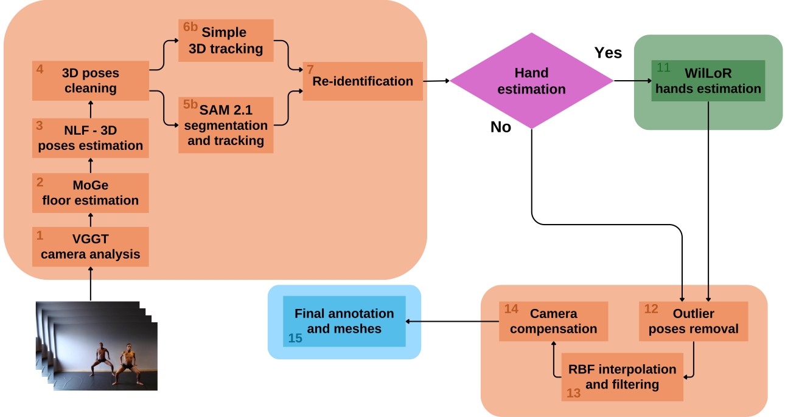

# MultiPerson Processing Pipeline Documentation

## 1. Overview

This script implements a comprehensive pipeline for multi-person 3D pose estimation and tracking from video. It performs a series of sophisticated analyses including camera parameter estimation, floor plane detection, human pose estimation, tracking, segmentation, temporal filtering, and spatial adjustments. The pipeline produces numerous output files representing different stages of processing and refinement, with options for hand pose estimation and camera motion compensation.

---

## 2. Command-Line Arguments

| Argument                  | Type    | Default         | Description                                                                                                                  |
|---------------------------|---------|-----------------|------------------------------------------------------------------------------------------------------------------------------|
| `--directory`             | `str`   | `None`          | Directory for storing output files. **Required**.                                                                            |
| `--video`                 | `str`   | `None`          | Path to the video file to process. **Required**.                                                                             |
| `--fov`                   | `float` | `0`             | Field of view override for 3D pose estimation. Defaults to auto-estimation if `0`.                                           |
| `--camtoltranslation`     | `float` | `0.2`           | Camera translation tolerance (in meters) for detecting camera movement.                                                      |
| `--camtolrotation`        | `float` | `2`             | Camera rotation tolerance (in degrees) for detecting camera rotation.                                                        |
| `--camtolfov`             | `float` | `3`             | Camera FOV tolerance (in degrees) for detecting FOV changes.                                                                 |
| `--framesampling`         | `float` | `0.5`           | Frame sampling in seconds for analysis steps.                                                                                |
| `--rbfkernel`             | `str`   | `"linear"`      | RBF kernel for filtering. Choices: `["linear", "multiquadric", "univariatespline"]`.                                         |
| `--rbfsmooth`             | `float` | `-1`            | Smoothness parameter for RBF filtering. Default computed if `< 0`.                                                           |
| `--rbfepsilon`            | `float` | `-1`            | Epsilon parameter for RBF filtering. Default computed if `< 0`.                                                              |
| `--step`                  | `int`   | `0`             | Start at a specific step (0 = all steps).                                                                                    |
| `--batchsize`             | `int`   | `25`            | Batch size for 3D pose estimation.                                                                                           |
| `--displaymode`           | flag    | `False`         | Enables display mode during processing.                                                                                      |
| `--handestimation`        | flag    | `False`         | Enables hand pose estimation based on Wilor.                                                                                 |
| `--detectionthreshold`    | `float` | `0.3`           | Human detection threshold.                                                                                                   |
| `--dispersionthreshold`   | `float` | `0.1`           | Threshold for human dispersion in segmentation/tracking.                                                                     |
| `--copyvideo`             | flag    | `False`         | Copy the video to output directory if set.                                                                                   |
| `--scalefactor`           | `float` | `0`             | Scale factor for camera compensation (0 = auto).                                                                             |

---

## 3. Pipeline Steps

### Step 0: VGGT Camera Analysis
- **Condition**: Executes if `--step <= 0`.
- **Scripts**: 
  - `videoCameraPosesAnalysisVGGT.py`
  - `interpolateCameraPosesVGGT.py`
- **Outputs**:
  - `vggt.pkl`, `vggt.glb`, `vggt-interpolated.pkl`
- **Purpose**: Analyzes camera parameters including FOV, movement patterns, and produces interpolated camera poses.

### Extract Data from VGGT Analysis
- **Always executed after Step 0 (if not skipped)**.
- **Purpose**: Determines if camera has dynamic FOV and if camera position is fixed or moving.

### Step 1: MoGe Floor Analysis
- **Condition**: Executes if `--step <= 1`.
- **Script**: `floorAnalysisMoge.py`
- **Outputs**:
  - `moge.pkl`
- **Purpose**: Analyzes floor plane and depth information.

### Step 2: Extract 3D Poses with NLF
- **Condition**: Executes if `--step <= 2`.
- **Script**: `videoNLF.py`
- **Outputs**:
  - `nlf.pkl`: Raw 3D pose estimates.
- **Purpose**: Detects humans and estimates 3D poses.

### Determine Number of Humans
- **Always executed after Step 2 (if not skipped)**.
- **Purpose**: Calculates statistical data on human counts (majority, maximum, minimum).

### Step 3: Clean Poses & Inject Camera Properties
- **Condition**: Executes if `--step <= 3`.
- **Scripts**:
  - `cleanFramesPkl.py`
  - `computeCameraProperties.py`
  - `injectCameraPropertiesPkl.py`
- **Outputs**:
  - `nlf-clean.pkl`: Cleaned poses with consistent human count.
  - `video.json`: Camera properties.
- **Purpose**: Cleans frames to maintain consistent number of humans and injects camera properties.

### Step 4: 3D Tracking
- **Condition**: Executes if `--step <= 4`.
- **Script**: `tracking3DPkl.py`
- **Outputs**:
  - `nlf-clean-track.pkl`: Poses with tracking data.
- **Purpose**: Adds tracking information to maintain identity of people across frames.

### Step 5: Add SAM2.1 Tracking
- **Condition**: Executes if `--step <= 5`.
- **Script**: `sam21MultiHMR.py`
- **Outputs**:
  - `nlf-clean-track-seg.pkl`: Poses with segmentation data.
  - `nlf-videoSegmentation.mp4`: Visualization video.
- **Purpose**: Uses SAM2.1 for improved segmentation and tracking.

### Step 6: Tracks Fusion
- **Condition**: Executes if `--step <= 6`.
- **Script**: `tracksFusion.py`
- **Outputs**:
  - `nlf-clean-track-seg-fusion.pkl`: Poses with consolidated tracking data.
- **Purpose**: Consolidates multiple tracks of the same person.

### Step 7: Remove Outliers
- **Condition**: Executes if `--step <= 7`.
- **Script**: `removeOutlier.py`
- **Outputs**:
  - `nlf-clean-track-seg-fusion-outlier.pkl`: Cleaned pose data.
- **Purpose**: Removes anomalous pose data.

### Step 8: Optional Hand Pose Estimation
- **Condition**: Executes if `--step <= 8` AND `--handestimation = True`.
- **Script**: `injectHandsPkl.py`
- **Outputs**:
  - `nlf-clean-track-seg-fusion-outlier-handestimation.pkl`: Poses with hand data.
- **Purpose**: Adds hand pose estimation data.

### Step 9: RBF Filtering
- **Condition**: Executes if `--step <= 9`.
- **Script**: `RBFFilterSMPLX.py`
- **Outputs**:
  - `*-filtered.pkl`: Temporally filtered pose data.
- **Purpose**: Applies RBF filtering for temporal smoothness.

### Copy Final PKL Files
- **Always executed**.
- **Outputs**:
  - `nlf-final.pkl`
  - `nlf-final-filtered.pkl`
- **Purpose**: Standardizes final output filenames.

### Step 10: Camera Compensation
- **Condition**: Executes if `--step <= 10`.
- **Scripts**:
  - `cameraCompensation.py`
  - `cameraFloorCompensation.py`
- **Outputs**:
  - `nlf-final-camerac.pkl`: Camera-compensated poses.
  - `nlf-final-filtered-camerac.pkl`: Filtered camera-compensated poses.
  - `nlf-final-floorc.pkl`: Floor-compensated poses.
  - `nlf-final-filtered-floorc.pkl`: Filtered floor-compensated poses.
- **Purpose**: Adjusts poses to account for camera movement and floor orientation.

---

## 4. Execution Flow

1. **Initialization and Parameter Setting**:
   - Parse command-line arguments
   - Extract video properties (width, height, FPS, frame count)
   - Set automatic parameters based on video properties (RBF parameters, etc.)

2. **Camera and Environment Analysis**:
   - VGGT camera analysis to determine camera movement patterns, FOV
   - MoGe floor analysis to establish ground plane

3. **Human Detection and Initial Processing**:
   - NLF 3D pose estimation
   - Statistical analysis of human counts
   - Clean poses to ensure consistent number of humans

4. **Tracking and Segmentation**:
   - 3D tracking to maintain identity across frames
   - SAM2.1 segmentation for improved human isolation
   - Track fusion to consolidate multiple detections of same person

5. **Data Refinement**:
   - Outlier removal to clean anomalous poses
   - Optional hand estimation for detailed hand poses
   - RBF filtering for temporal smoothness

6. **Final Processing and Output**:
   - Standardize final filenames
   - Apply camera compensation to provide world-space coordinates
   - Apply floor compensation for consistent orientation

7. **Results Summary**:
   - Report execution time
   - Print video.json information with color coding for key metrics

---

## 5. Summary

### Key Components and Features

1. **Comprehensive Video Analysis**:
   - Detailed camera parameter estimation with VGGT
   - Floor plane detection with MoGe
   - Accurate 3D human pose estimation with NLF

2. **Advanced Tracking and Segmentation**:
   - 3D tracking for maintaining identity across frames
   - SAM2.1 integration for improved segmentation
   - Track fusion to consolidate multiple detections

3. **Sophisticated Data Processing**:
   - Outlier removal for cleaning anomalous data
   - RBF filtering with adaptive parameters for temporal smoothness
   - Optional hand pose estimation for detailed hand articulation

4. **Spatial Compensation**:
   - Camera motion compensation for world-space coordinates
   - Floor plane compensation for consistent orientation

5. **Flexible Execution**:
   - Step-based processing allows starting from any point in the pipeline
   - Configurable thresholds and parameters for different video types
   - Display mode for visual debugging

6. **Comprehensive Output**:
   - Multiple output formats capturing different processing stages
   - Visualization video for segmentation results
   - Detailed video properties and statistics

This pipeline represents a state-of-the-art approach to multi-person 3D pose estimation and tracking from monocular video. It handles challenges such as camera movement, varying human counts, and temporal inconsistencies to produce high-quality 3D pose data suitable for downstream applications in animation, biomechanics, and motion analysis.