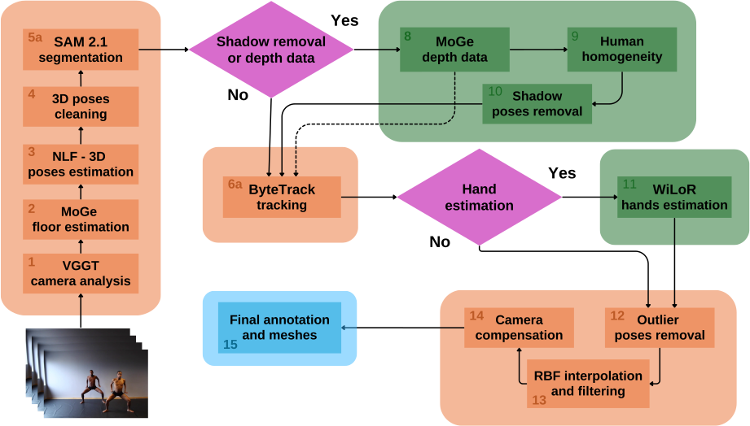

# premiereFullVideoProcessing Documentation

## 1. Overview

This script orchestrates scene detection, splitting, and processing operations for video files. It performs the following main functions:

1. Detects scenes in a video using PySceneDetect (ContentDetector or AdaptiveDetector)
2. Splits the video into scene-based sub-videos
3. Optionally processes each scene by calling `premiereProcessing.py` script
4. Optionally fuses the resulting .pkl files across scenes into a single set of files

The script can be run in various modes to handle different parts of the pipeline independently, allowing for scene generation only, scene processing only, or fusion of processed data from multiple scenes.

---

## 2. Command-Line Arguments

| Argument                  | Type    | Default         | Description                                                                      |
|---------------------------|---------|-----------------|----------------------------------------------------------------------------------|
| `--directory`             | `str`   | `None`          | Directory to store the processed files. **Required**.                            |
| `--video`                 | `str`   | `None`          | Path to the video file to process. **Required**.                                 |
| `--fov`                   | `float` | `0`             | Field of view for the 3D pose estimation.                                        |
| `--rbfkernel`             | `str`   | `"linear"`      | RBF kernel for filtering. Choices: `["linear", "multiquadric"]`.                 |
| `--rbfsmooth`             | `float` | `-1`            | Smoothness parameter for RBF filtering. Default computed if `< 0`.               |
| `--rbfepsilon`            | `float` | `-1`            | Epsilon parameter for RBF filtering. Default computed if `< 0`.                  |
| `--step`                  | `int`   | `-1`            | Step to process (`-1` for all steps).                                            |
| `--scene`                 | `int`   | `-1`            | Scene to process (`-1` for all scenes).                                          |
| `--batchsize`             | `int`   | `25`            | Batch size for NLF 3D pose estimation.                                           |
| `--displaymode`           | flag    | `False`         | Enables display mode during processing.                                          |
| `--handestimation`        | flag    | `False`         | Enables hand pose estimation.                                                    |
| `--removeshadows`         | flag    | `False`         | Enables shadow removal.                                                          |
| `--removeshadowsthreshold`| `float` | `0.00015`       | Threshold for shadow removal.                                                    |
| `--detectionthreshold`    | `float` | `0.3`           | Threshold for human detection.                                                   |
| `--onlygeneratesscenes`   | flag    | `False`         | Only generate scenes, don't process them.                                        |
| `--donotgeneratesscenes`  | flag    | `False`         | Skip scene generation step.                                                      |
| `--fusionpklfiles`        | flag    | `False`         | Generate fusion of PKL files from all scenes.                                    |
| `--framesampling`         | `float` | `0.5`           | Frame sampling in seconds for MoGe and MAST3r analysis.                          |
| `--scalefactor`           | `float` | `0`             | Scale factor for camera compensation.                                            |
| `--camtoltranslation`     | `float` | `0.2`           | Camera translation tolerance (meters) for detecting camera movement.             |
| `--camtolrotation`        | `float` | `2`             | Camera rotation tolerance (degrees) for detecting camera rotation.               |
| `--camtolfov`             | `float` | `3`             | Camera FOV tolerance (degrees) for detecting FOV changes.                        |

---

## 3. Pipeline Steps

### Scene Detection and Splitting
- **Condition**: Executes if `generatesScenes = True` (based on various parameter combinations).
- **Process**:
  - Detects scenes using PySceneDetect's AdaptiveDetector (or ContentDetector).
  - Splits the video into separate files using ffmpeg.
  - Organizes files into directories named `scene_XXX/video.mp4`.
- **Outputs**:
  - Scene directories with video files.

### Scene Processing
- **Condition**: Executes if `onlyGeneratesScenes = False` and `fusionpklfiles = False`.
- **Process**:
  - For each scene (or a specific scene if `--scene` is specified):
    - Calls `premiereProcessing.py` with appropriate arguments.
    - Forwards most arguments to the processing script.
- **Outputs**:
  - Per-scene processing results (PKL files) as defined by `premiereProcessing.py`.

### Frame Count Analysis
- **Condition**: Executes in some conditions where not processing.
- **Process**:
  - Counts frames across all scenes.
  - Compares to the original video's frame count.
- **Outputs**:
  - Console log with frame counts.

### PKL File Fusion
- **Condition**: Executes if `fusionpklfiles = True`.
- **Process**:
  - Calls `saveFusion()`, which calls `saveFusionFile()` twice for different PKL types.
  - Combines data from multiple scene PKLs into unified files.
  - Preserves per-scene metadata (floor angles, offsets, indices).
- **Outputs**:
  - `fusion-nlf-final.pkl`
  - `fusion-nlf-final-filtered.pkl`

---

## 4. Execution Flow

### Scene Generation Logic
The script uses several parameters to determine if scene generation should occur:
- If `step == -1` (process all steps) → set `step = 0` and `generatesScenes = True`
- If `donotgeneratesscenes` or `fusionpklfiles` flags are set → `generatesScenes = False`
- If specific `scene` is specified → `generatesScenes = False`
- If `onlyGeneratesScenes` flag is set → override to `generatesScenes = True`

### Processing Logic
If not only generating scenes or fusing files:
1. If `scene == -1`: Process all scenes in sequence.
2. Otherwise: Process only the specified scene.

Both paths call `premiereProcessing.py` with appropriate arguments.

### Fusion Logic
If the `fusionpklfiles` flag is set:
1. Gather all scene directories.
2. Call `saveFusion()` which:
   - Fuses `nlf-final.pkl` files into `fusion-nlf-final.pkl`.
   - Fuses `nlf-final-filtered.pkl` files into `fusion-nlf-final-filtered.pkl`.

---

## 5. Summary

### Key Components and Workflow

1. **Scene Detection and Management**:
   - Uses PySceneDetect's adaptive or content detection algorithms.
   - Splits videos into scenes with ffmpeg.
   - Organizes scenes into directories with proper naming conventions.

2. **Processing Options**:
   - **Full Pipeline**: Generate scenes → Process each scene → Fusion (optional).
   - **Partial Pipeline**: Skip scene generation and/or process specific scenes.
   - **Fusion Only**: Combine already processed scene data into unified files.

3. **Scene Processing**:
   - Each scene is processed independently using `premiereProcessing.py`.
   - Processing includes human detection, 3D pose estimation, segmentation, optional shadow removal, etc.

4. **Fusion Process**:
   - Combines `allFrameHumans` data from multiple scenes.
   - Preserves per-scene metadata (floor angles, Z offsets, start/end indices).
   - Creates unified PKL files for downstream applications.

5. **Performance Analysis**:
   - Records and reports execution time.
   - Reports frame counts for validation.

### Advantages of the Scene-Based Approach

1. **Modularity**: Process scenes independently, allowing parallel processing or focused debugging.
2. **Robustness**: Scene changes often correspond to camera or setting changes, which benefit from independent processing.
3. **Flexibility**: Process only specific scenes or stages as needed.
4. **Integration**: Final fusion step provides unified data for applications needing continuous data.

This pipeline is particularly valuable for processing lengthy videos with distinct scenes, where scene-specific processing parameters might be beneficial, and where memory constraints make processing the entire video at once impractical.